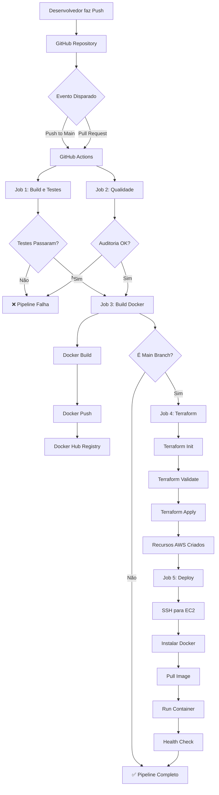
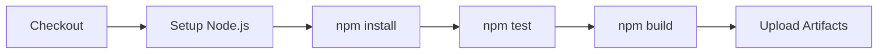
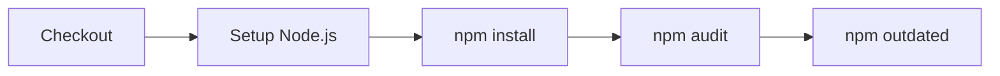
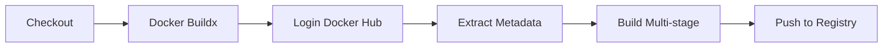
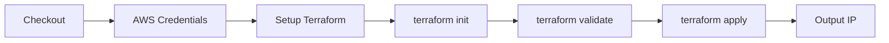
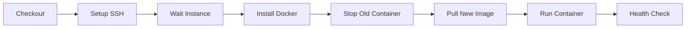
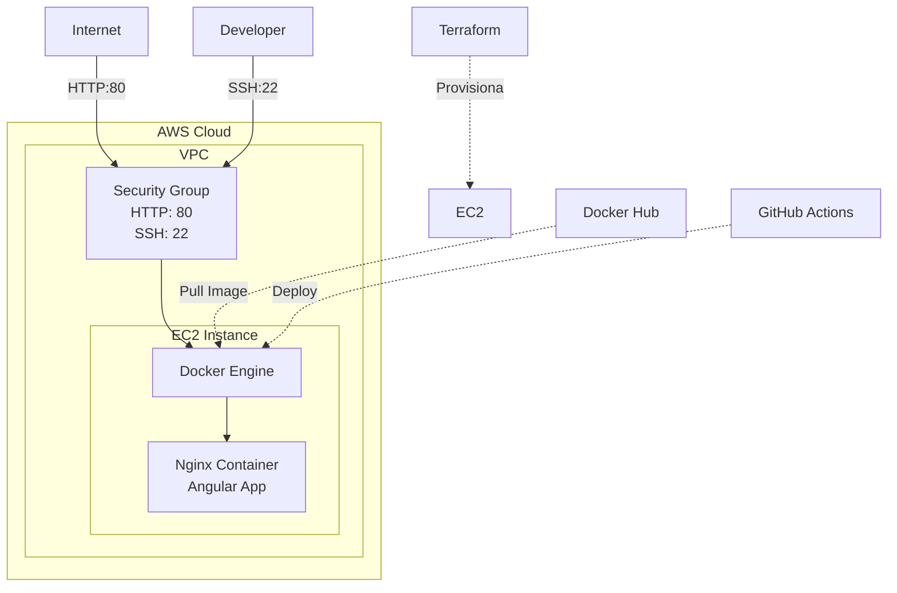
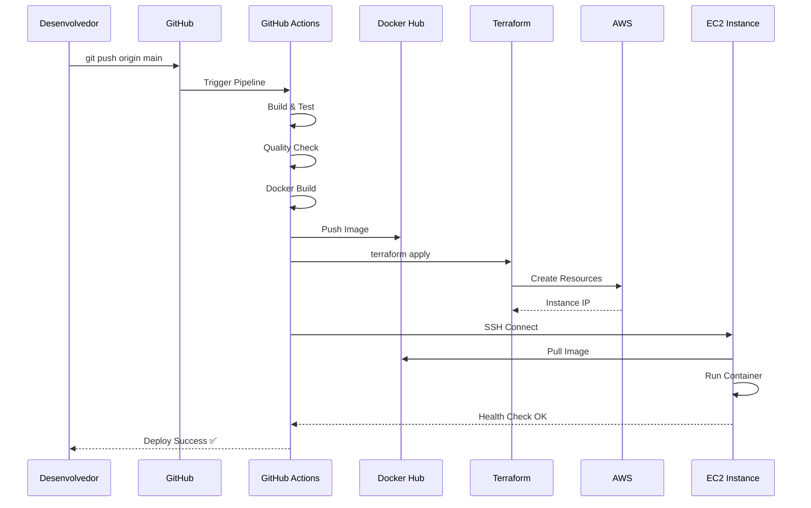

# Fluxograma DevOps - Pipeline Completo

## Visão Geral do Fluxo



## Detalhamento dos Jobs

### 1. Build e Testes



### 2. Análise de Qualidade



### 3. Build Docker



### 4. Terraform (IaC)



### 5. Deploy para EC2



## Arquitetura da Infraestrutura



## Fluxo de Dados



## Timeline do Pipeline

```
┌───────────────────────────────────────────────────┐
│  Timeline Aproximada do Pipeline (8-10 minutos)   │
├───────────────────────────────────────────────────┤
│                                                   │
│  0min ─┬─ Build & Test (2-3 min)                  │
│        ├─ Quality Check (1 min)                   │
│        │                                          │
│  3min ─┴─ Docker Build (2 min)                    │
│                                                   │
│  5min ─┬─ Terraform Apply (1-2 min)               │
│        │                                          │
│  7min ─┴─ Deploy to EC2 (2-3 min)                 │
│           ├─ Install Docker                       │
│           ├─ Pull Image                           │
│           ├─ Run Container                        │
│           └─ Health Check                         │
│                                                   │
│ 10min ─── Pipeline Complete                       │
└───────────────────────────────────────────────────┘
```
